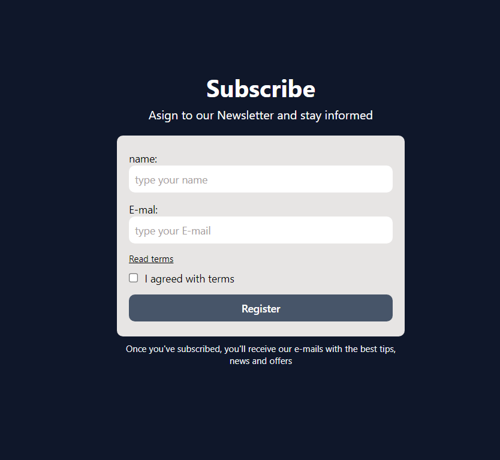

# (Newsletter)

This is a [Newsletter](project link). 

## Table of contents

- [Overview](#overview)
  - [The purpose](#The-purpose)
  - [Screenshot](#screenshot)
- [My process](#my-process)
  - [Built with](#built-with)
  - [What I learned](#what-i-learned)
  - [Continued development](#continued-development)
  - [Useful resources](#useful-resources)
- [Author](#author)

## Overview

### The-purpose

Users should be able to:

- Input their name, email and agree to the terms
- Once the fields are full filled with correct user's data, we validate and send it to backend

### Screenshot



## My process

### Built with

- Semantic HTML5 markup
- CSS custom properties
- [React](https://reactjs.org/) - JS library
- Tailwind for style
- Typescript for typing

### What I learned

How to build a validation file

```js
import { User } from "../types/User";

type Error = {
    [key: string]: string
};

export const validate = (data: User) => {
    const errors: Error = {};

    if(!data.name) {
        errors['name'] = "Your name is mandatory"
    }
    if(!data.email) {
        errors['email'] = "Your E-mail is mandatory" 
    }
    if(!data.agree) {
        errors['agree'] = "You need to agree" 
    }

    return errors;
};
```


### Continued development

establishing and maintaining strict standardization in my project files, this contributes to the quality of the code, making it easier to read, maintain and collaborate with team members.


## Author

- Website - [Leandro](https://leandro-pixel.github.io/React-Portfolio/)
- Linkdin - [@Leandro-Soares-Neves](https://www.linkedin.com/in/leandro-soares-neves/)

